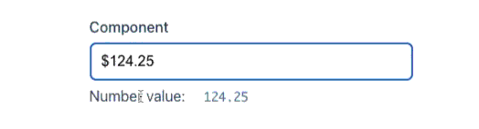

[](https://www.npmjs.com/package/@coders-tm/vue-number-format)
[](https://www.npmjs.com/package/@coders-tm/vue-number-format)
[](https://github.com/coders-tm/vue-number-format)
[](https://bundlephobia.com/result?p=@coders-tm/vue-number-format)
[](https://github.com/coders-tm/vue-number-format/blob/master/LICENSE)
[](https://github.com/sponsors/dipaksarkar)

# vue-number-format

<a href="https://vue-number-format.netlify.app" rel="nofollow"></a>

Vue Number Format is used to format a number using fixed-point notation. It can be used to format a number with a specific number of digits to the right of the decimal.

## Installation

```bash
npm install @coders-tm/vue-number-format
or
yarn add @coders-tm/vue-number-format
```

## Features

- Lightweight
- Dependency free
- Component or Directive flavour
- Format as you type
- Built-in validation
- Supports both Vue 3 and Vue 2.

## Documentation

Please refer to the [project home page](https://vue-number-format.netlify.app) for a detailed documentation.

## Support me

If you find my work helpful, or you want to support the development, star the repo or buy me a coffee:

[](https://ko-fi.com/dipaksarkar)
